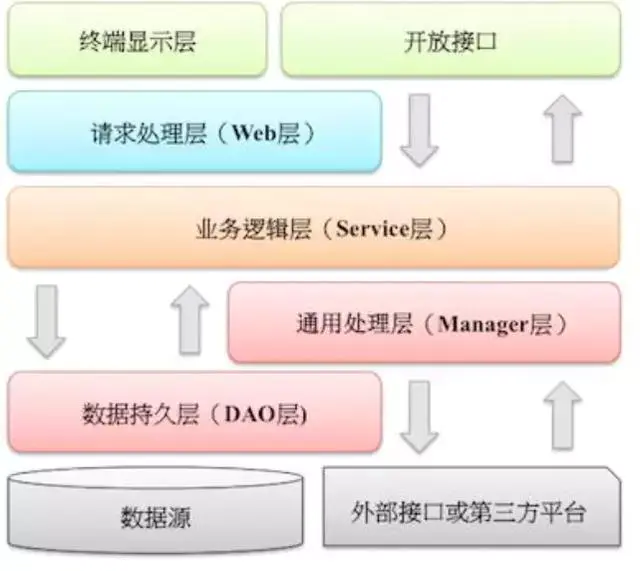
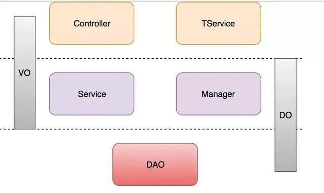

# 我的人脉系统

## 1. 设计

1. 前后端使用的技术

   * 前端

     * Vue

     * Element

   * 后台
		* spring cloud
		* springboot + springMVC + Mybatis
		* 缓存 ： redis
		* 消息中间件： rocketMQ
		* 数据库： MySQL
	
2. 后端项目代码机构

   * 后端项目代码分层

   	1. web层。 

       主要是对访问控制进行转发，各类基本参数校验，或者不复用的业务简单处理等。 

   	2. service层

       相对具体的业务逻辑服务层。 

   	3. manager层

      通用业务处理层，它有如下特征:1. 对第三方平台封装的层，预处理返回结果及转化异常信息;2. 对Service层通用能力的下沉，如缓存方案、中间件通用处理;3. 与DAO层交互，对多个DAO的组合复用。

   	4. dao层

       数据访问层，与底层 MySQL、 进行数据交互。 
     
       
     
   * 分层领域模型的转换

     1.  DO（Data Object）：与数据库表结构一一对应，通过DAO层向上传输数据源对象。 

     2.  DTO（Data Transfer Object）：数据传输对象，Service或Manager向外传输的对象。 

     3.  VO（View Object）：显示层对象，通常是Web向模板渲染引擎层传输的对象。 

          

3. 